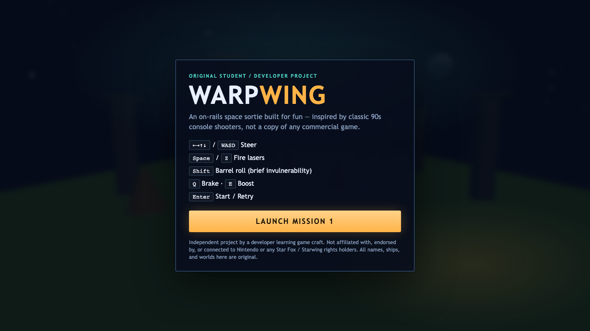
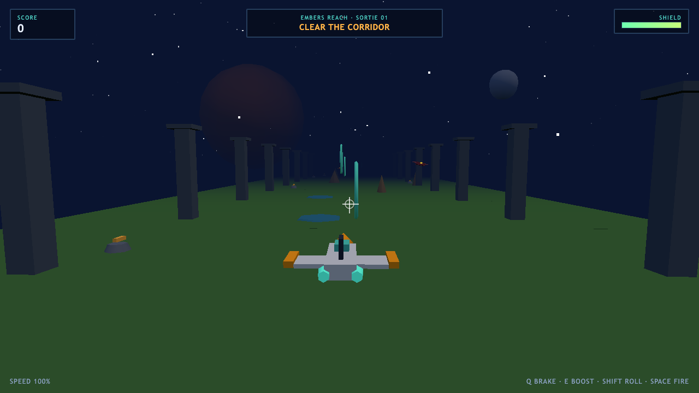
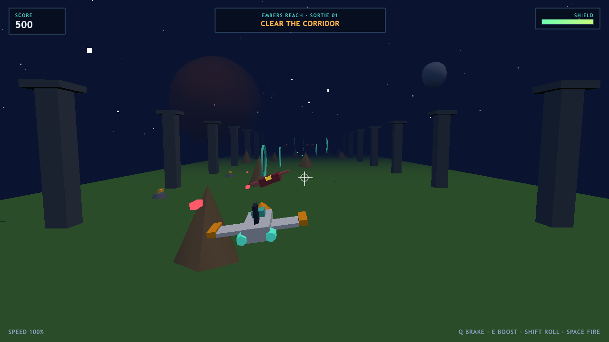
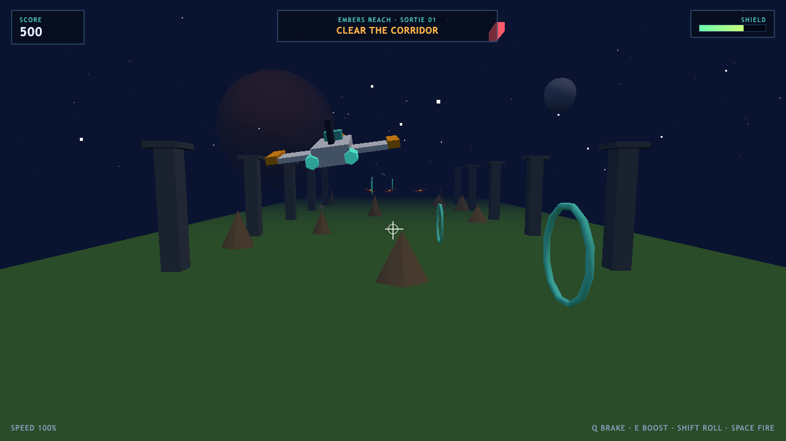

# WarpWing

**This is my attempt at building a new game.**

I'm a developer learning real-time graphics and game feel. WarpWing is an **original** on-rails space shooter inspired by the *genre* of 1990s console rail shooters — low-poly look, corridor flight, barrel rolls, boost/brake, and ring chasing.

It is **not** Star Fox, Starwing, or any Nintendo product.

```bash
npm install
npm run dev
```

Open the URL Vite prints (usually `http://localhost:5173`), click **LAUNCH MISSION 1**, and fly.

---

## Live gameplay

Real captures from the running WebGL build:

<p align="center">
  
</p>

<p align="center">
  
</p>

<p align="center">
  
</p>

<p align="center">
  
</p>

---

## Important disclaimer (please read)

WarpWing is an **independent student / developer practice project**.

- Not affiliated with, endorsed by, sponsored by, or connected to **Nintendo**.
- Not affiliated with any **Star Fox** / **Starwing** rights holders.
- No Nintendo trademarks, character names, level names, ships, music, or assets are used.
- All names in this game are original: **WarpWing**, **Nova Dart**, **Emberreach**, **Callen Voss** (pilot fiction in README only).
- Gameplay systems (on-rails shooting, barrel roll, rings) are common genre ideas, rebuilt from scratch in Three.js.

If you work for a rights holder and believe something here still crosses a line, open an issue — I'll correct it promptly.

See [DISCLAIMER.md](DISCLAIMER.md).

---

## Controls

| Input | Action |
|---|---|
| WASD / Arrows | Steer |
| Space / Z | Fire |
| Shift | Barrel roll |
| Q | Brake |
| E | Boost |
| Enter | Start / retry |

---

## Mission 1 — Emberreach Corridor

Pilot the **Nova Dart** through a low-poly canyon under the skies of **Emberreach**. Blast hostiles, thread score rings, survive the gate fighters, and clear the sortie.

---

## Stack

- Vite + TypeScript
- Three.js (WebGL)
- Original procedural meshes + tiny WebAudio beeps (no ripped ROMs, WAVs, or packs)

---

## Scripts

```bash
npm run dev       # local play
npm run build     # production build
npm run preview   # preview build
```

---

## License

MIT for the source in this repository — see [LICENSE](LICENSE).  
Third-party libraries keep their own licenses. Nintendo and related marks belong to their owners.

---

<p align="center"><b>Built for fun. Built to learn. Built to be original.</b></p>
